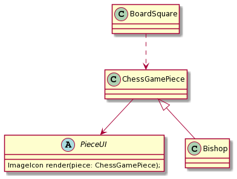

# Modelo Inicial

### SRP - Bishop
Se ve que en la clase Bishop aparte de crear los movimientos de la pieza, se ocupa también de cómo pintarlo, o sea tiene más de una responsabilidad, por lo cual se ha considerado separar en otra clase `PieceUI` la responsabilidad de pintar la pieza.

